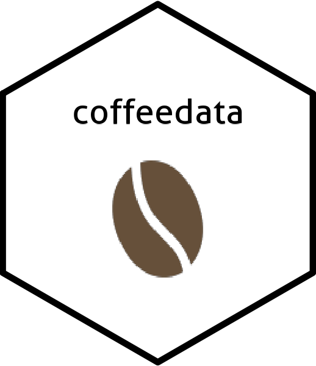

<!-- README.md is generated from README.Rmd. Please edit that file -->

```{r, include = FALSE}
knitr::opts_chunk$set(
  collapse = TRUE,
  comment = "#>",
  fig.path = "man/figures/README-",
  out.width = "100%"
)
```

# coffeedata 

<!-- badges: start -->
<!-- badges: end -->

A dataset where each row is a time I made coffee.

## Installation

You can download the development version from [GitHub](https://github.com/) with:

``` r
# install.packages("devtools")
devtools::install_github("ayoskovich/coffeedata")
```
## Example

This is a basic example which shows you how to solve a common problem:

```{r example}
library(coffeedata)
library(magrittr)

bean_dat %>% 
  head() %>%
  knitr::kable()
```
